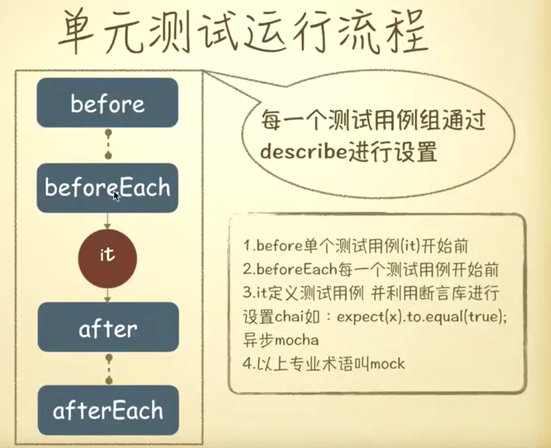

## 测试核心概念
1. 单元测试<br/>
<br/>
1.1 [karma](http://karma-runner.github.io/3.0/intro/installation.html)测试环境搭建<br/>
```
// 第1步
npm init

// 第2步
npm i jasmine-core karma karma-chorme-launcher karma-jasmine karma-phantomjs-launcher --save-dev

// 第3步：编写测试案例-->在项目根目录按如下路径创建文件tests/unit/index.js, tests/unit/index.spec.js
// index.js
window.add = function (a) {
  return a + 1;
}
//index.spec.js
describe("函数的基本API测试", function() {
  it("+1函数是否可用", function () {
    expect(window.add(1)).toBe(3)
  })
})
// 第4步: 初始karma，生成一个karma.conf.js
karam init 
// 第5步: 修改karma.conf.js
{
  ...
  // list of files / patterns to load in the browser
  files: [
    './tests/unit/*.js',
    './tests/unit/*.spec.js'
  ],
  ...
  singleRun: true,
  ...
}

// 当编辑一些测试用例后，第3步：运行
方式1：./node_modules/karma/bin/karma start 
方式2：karma start
```
1.2 利用selenium-webdriver自动化e2e测试环境搭建<br/>
```
// 第1步：
npm i selenium-webdriver -D

// 第2步：下载驱动，并把驱动复制到项目根目录下
[Chrome]-->	chromedriver(.exe)
[Internet Explorer]-->	IEDriverServer.exe
[Edge]-->	MicrosoftWebDriver.msi
[Firefox]-->	geckodriver(.exe)
[Opera]-->	operadriver(.exe)
[Safari]-->	safaridriver

// 第3步：编写测试案例-->在项目根目录按如下路径创建文件tests/e2e/index.js
const {Builder, By, Key, until} = require('selenium-webdriver');

(async function example() {
  let driver = await new Builder().forBrowser('firefox').build();
  try {
    await driver.get('https://www.baidu.com/');
    await driver.findElement(By.name('wd')).sendKeys('webdriver', Key.RETURN);
    await driver.wait(until.titleIs('webdriver_百度搜索'), 1000);
  } finally {
    await driver.quit();
  }
})();

// 第4步：package.json
{
  ...
  "scripts": {
    ...
    "e2e": "node ./tests/e2e/index.js"
  },
  ...
}

// 第5步：执行测试
npm run e2e
```
1.3 服务端代码测试-mocha搭建<br/>
1.4 其他测试框架：jest,f3etest,nightwatch,rize<br/>

2. 性能测试<br/>
3. 安全测试<br/>
4. 功能测试<br/>
5. UI还原测试<br/>