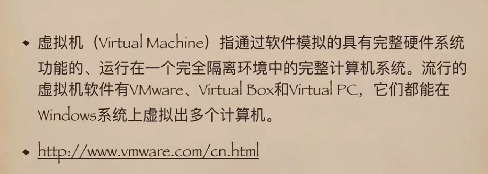

## 虚拟机（Virtual Machine）


## Linux基本命令行
```
// 查看文件夹下文件及文件夹清单
ls [-l|-a]
dir

// 切换目录(区分大小写)
cd
// 返回上一层目录
cd ..

// 创建文件夹
mkdir newFolder


// 复制文件
cp a.txt newFolder/a_copy.txt


// 复制文件夹
cp -R newFolder copyNewFolder

// 显示当前目录
pwd

// 删除文件
rm a_copy.txt

// 删除文件夹
rm -r copyNewFolder

```

## Window基本命令行
```
// 查看文件夹下文件及文件夹清单
dir

// 切换目录
cd
cd ..

// 创建文件夹
md newFolder

// 复制a.txtd至newFolder文件夹下
copy a.txt newFolder

// 删除文件（永久删除）
del a.txt

// 将b.txt重命名为c.txt
rename b.txt c.txt

```