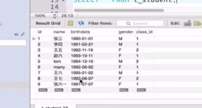
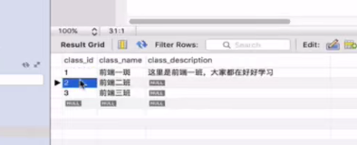
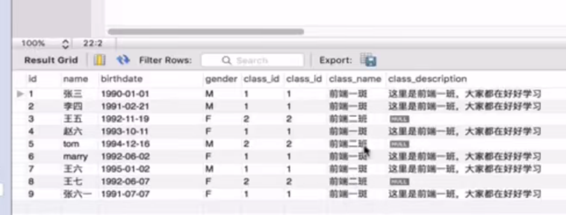
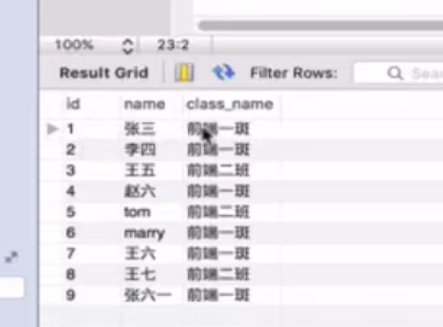

## 数据库客户端基础
* 通过命令行登录MySQL -u后面的root是用户名，中间不需要空格；回车后输入密码
```
mysql -uroot -p
```
* 展示MySQL中的数据库列表
```
show databases;
```
* 切换到某个数据库
```
use db_test;
```
* 创建数据库db_test,并设定字符集为utf8
```

CREATE SCHEMA 'db_test' DEFAULT CHARACTER SET utf8
```
* 创建表
```
CREATE TABLE `db_test`.`t_student` (
  `id` INT NOT NULL AUTO_INCREMENT COMMENT '注释',
  `name` VARCHAR(40) NOT NULL COMMENT '注释',
  `gender` CHAR(1) NOT NULL COMMENT '男：m\n女： f',
  `birthday` DATE NOT NULL COMMENT '生日',
  PRAMARY KEY (`id`) COMMENT '');
```
并手动添加一些数据，如下图：<br/>

* 增删改查
```
insert into 
delete
update
select
```
* sql语句注释  两个短横线+一个空格
```
-- min() --> 找出年龄最大的记录
-- SELECT min(birthday), t_student.* FROM db_test.t_student
```
* sql函数
```
SELECT min(birthday), t_student.* FROM db_test.t_student // min() --> 找出年龄最大的记录；
SELECT max(birthday), t_student.* FROM db_test.t_student // max() --> 找出年龄最小的记录
// sum() --> 求和
// sqrt() --> 求平方根
// count() --> 计数
// now() --> 执行sql时的当前时间
// rand() --> 随机数（0~1）
// concat(id, '-',name) --> 拼接字符串(常用于生成报表)
```
* where语句
```
// 查询出生日期（birthday）1991-1993年之间记录
// 方法1：
SELECT * FROM t_student WHERE birthday >= '1991-01-01' AND birthday <= '1993-01-01'
// 方法2：
SELECT * FROM t_student WHERE birthday BETWEEN '1991-01-01' AND '1993-01-01'
```
* LIKE和通配符（%）
```
// 查询姓“王”的记录
SELECT * FROM t_student WHERE name LIKE '王%'
// '王%' --> 查询姓名以“王”开始的记录
// '%六%' --> 查询姓名包含“六”的记录
// '%六' --> 查询姓名以“六”结尾的记录
```
* 排序（ORDER BY）
```
// 默认（ASC）
SELECT * FROM t_student ORDER BY birthday

// 逆序（DESC） 时间越靠前的在后面
SELECT * FROM t_student ORDER BY birthday DESC

```
## 多表查询
* 普通方式<br/>


```
SELECT * FROM t_student,t_class WHERE t_student.class_id = t_class.class_id // 查询结果图1-1
SELECT t_student.id, t_student.name, t_class.class_name FROM t_student,t_class WHERE t_student.class_id = t_class.class_id // 查询结果图1-2
```

<br/>图1-1<br/>

<br/>图1-2

* 左连接（LEFT JOIN）
```
SELECT t_student.id, t_student.name, t_class.class_name FROM t_student LEFT JOIN t_class ON t_student.class_id = t_class.class_id // 查询结果图1-2
```

