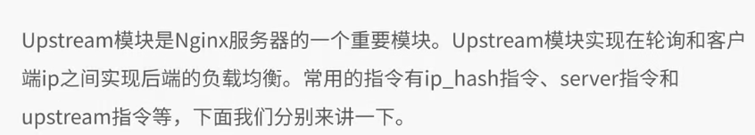
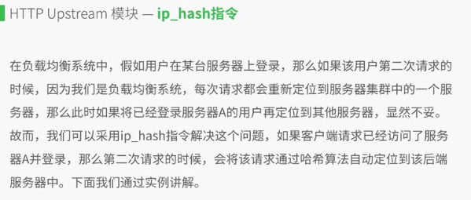
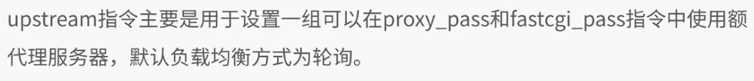
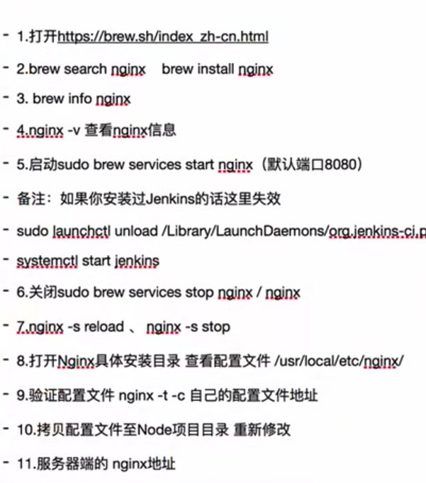

## 正向代理与反向代理
<br/>

## 什么是负载均衡
<br/>

## Nginx负载均衡的实现
<br/>
## HTTP Upstream模块
1. 什么是HTTP Upstream模块
<br/>

2. ip_hash指令
<br/>

3. server指令
<br/>

3. Upstream指令及相关变量
<br/>

## NodeJs上线步骤
<br/>
1.  代理配置

```
upstream test{
  ip_hash; // 保证同一个IP每次访问的都是同一个服务器
  server 192.168.32.21 weight=2; // 权重2
  server 192.168.32.22;
}
sever{
  listen 8080; // 监听8080
  location / {
    proxy_pass http://test;  // 将8080的请求转到192.168.32.21、192.168.32.22
  }
}
```

2. nginx 服务器缓存策略
```
http {
  # 开启etag 缓存
  etag off;
  # 开启gzip
  gzip on;
  # 设置过期时间
  # 如果未添加add_header Cache-Control no-cache,文件将会被浏览器缓存,返回的状态码是200
  # 如果添加add_header Cache-Control no-cache,文件将不会被浏览器缓存,返回的状态码是304;
  expires 30d;
  add_header Cache-Control no-cache;
}
```
