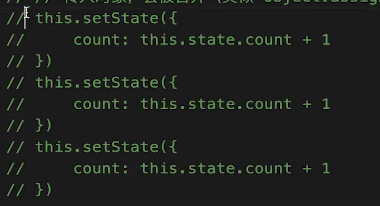
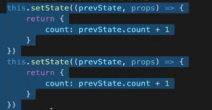
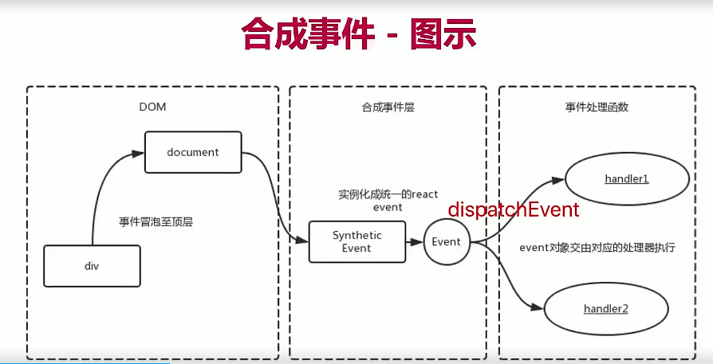
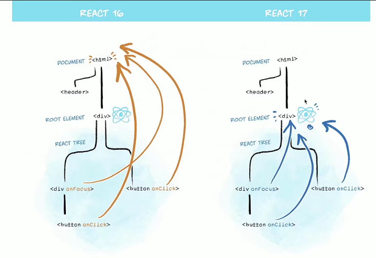

## 组件类型
1. class component
2. class pureComponent
3. functional component

## Flux架构
 

## [React源码深度解析](https://react.jokcy.me/)
https://react.jokcy.me/

## React-Fiber如何优化性能
1. 将reconciliation阶段进行任务拆分
2. dom渲染时暂停，空闲时恢复
3. window.requestIdleCallback

## setState
1. 有时异步（普通使用），有时同步（setTimeout，通过addEventListener绑定的原生时间内部）
2. 有时合并（对象形式），有时不合并（函数形式）---因为对象可以合并，函数体无法合并 
 
 

## 合成事件（synthetic event） 
 
1. 更好的兼容性和跨平台
2. 挂在到document（react v17开始，事件绑定在app入口的根节点上---实现微前端），减少内存消耗，避免频繁解绑 
 
3. 方便事件的统一管理（如事务机制）

## 为什么要使用hooks
1. 完善函数组件的能力，函数更适合React组件
2. 组件逻辑复用，Hooks表现更好
3. 用hook编写的组件，比class更加容易拆解，容易测试，逻辑清晰