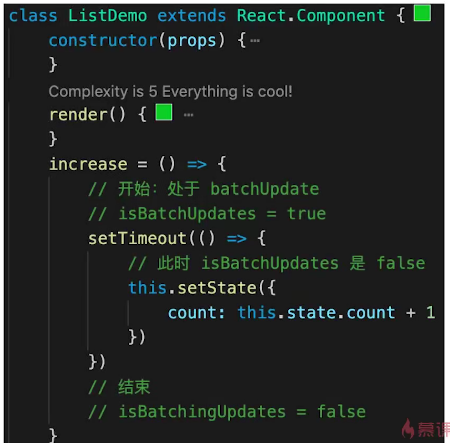

## 组件类型
1. class component
2. class pureComponent
3. functional component

## Flux架构
 

## [React源码深度解析](https://react.jokcy.me/)
https://react.jokcy.me/

## React-Fiber如何优化性能
1. 将reconciliation阶段进行任务拆分
2. dom渲染时暂停，空闲时恢复
3. window.requestIdleCallback

## setState

react 18 之前：
1. 有时异步（普通使用），有时同步（setTimeout，通过addEventListener绑定的原生时间内部） 
 
* 异步同步的关键在于执行状态更新时，是否处于batchUpdate机制中。 
 
 
 
 

2. 有时合并（对象形式），有时不合并（函数形式）---因为对象可以合并，函数体无法合并 
 
 

react 18 之后：setState都会表现为异步（即批处理）。

## 合成事件（synthetic event） 
 
1. 更好的兼容性和跨平台
2. 挂在到document（react v17开始，事件绑定在app入口的根节点上---实现微前端），减少内存消耗，避免频繁解绑 
 
3. 方便事件的统一管理（如事务机制）,可以在事件上区分事件优先级，优化用户体验

## 为什么要使用hooks
1. 完善函数组件的能力，函数更适合React组件
2. 组件逻辑复用，Hooks表现更好
3. 用hook编写的组件，比class更加容易拆解，容易测试，逻辑清晰

## fiber
在引入 Fiber 之前 React 采用的是同步渲染机制，即在组件树建立或者发生更新时，整个过程是同步不可中断的。在一个 React 的应用中，应用的渲染/更新会触发一段连续时间的 JS 执行，这期间 JS 阻塞布局、动画等其他工作。随着应用规模的扩大（组件数量的增长），所需的占用时间也将越来越长，这就导致应用可能出现掉帧、延迟响应（如 input 输入延迟、点击响应延迟等）等较差的交互体验。

在 v16 版本中，React 对其核心算法进行了大的改变，即使用了 Fiber 进行了重写。希望通 Fiber 来改变这种执行时长不可控的现状，进一步提升交互体验，使应用可以更加流畅。

简单来看，Fiber 就是把渲染/更新过程拆分成小的任务块，再通过合理的调度机制来控制执行这些任务块。在这种机制下，整个任务将可被暂停，复用及终止，这样以来就可以实现增量渲染（将任务拆分后，匀到多帧执行），而不像之前需要连续执行，同时可以给与不同任务不同优先级，允许任务插队。

从整体看虽然整个渲染/更新过程的工作量并没有减少，但由于有了任务优先级支持，我们在使用体验上可以减少很多延迟响应的情况，让应用感觉上更加流畅。

