## 左中右布局
方式1：
```
// dom结构
<body>
  <div class="middle">中</div>
  <div class="left">left</div>
  <div class="right">right</div>
</body>

// 样式
* {
  margin: 0;
  padding: 0;
}
div{
  height: 150px;
}
.left{
  float: left;
  width: 300px;
  background-color: red;
  margin-left: -100%;
}
.right{
  float: left;
  width: 200px;
  background-color: green;
  margin-left: -200px;
}
.middle{
  float: left;
  background-color: yellow;
  width: 100%;
  padding: 0 200px 0 300px;
  box-sizing: border-box;
}
// 缺点：div.middle中的盒子的样式都会继承box-sizing: border-box;
```

方式2：
```
// dom结构
<body>
  <div class="container">
    <div class="middle">中
      <div>111</div>
    </div>
    <div class="left">left</div>
    <div class="right">right</div>
  </div>
</body>

// 样式：
* {
  margin: 0;
  padding: 0;
}
div{
  height: 150px;
}
.container{
  padding: 0 200px 0 300px;
}
.left{
  float: left;
  width: 300px;
  background-color: red;
  margin-left: -100%;
  position: relative;
  left: -300px;
}
.right{
  float: left;
  width: 200px;
  background-color: green;
  margin-left: -200px;
  position: relative;
  right: -200px;
}
.middle{
  float: left;
  background-color: yellow;
  width: 100%;
}
```

方式3：
```
// dom结构
<body>
  <div class="container">
    <div class="middle">
      <div class="inner">中</div>
    </div>
    <div class="left">
    	left
    	<p>222</p>
    </div>
    <div class="right">right</div>
  </div>
</body>
// 样式

* {
  margin: 0;
  padding: 0;
}
<!-- 
 // 实现假等高
.container {
  overflow: hidden;
}
.container div{
  padding-bottom: 99999px;
  margin-bottom: -99999px;
}
-->
.left{
  float: left;
  width: 300px;
  background-color: red;
  margin-left: -100%;
}
.right{
  float: left;
  width: 200px;
  background-color: green;
  margin-left: -200px;
}
.middle{
  float: left;
  background-color: yellow;
  width: 100%;
}
.middle .inner {
  margin-left: 300px;
  margin-right: 200px;
}

```

## css3矩阵
1. 什么是矩阵？<br/>  
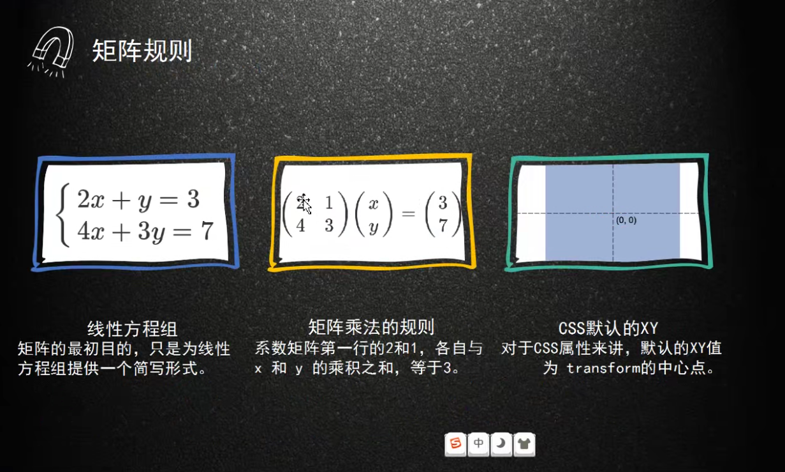

2. css属性：matrix

## 比较好用的CSS基础样式库
1. reset.css
2. normalize.css
3. neat.css

## Icon-font与常用字体排版
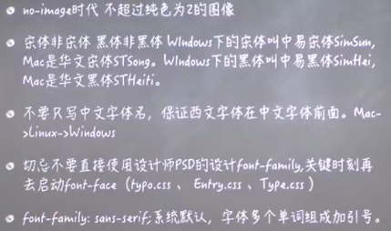<br/>

## css分层理论
为什么要分层<br/>
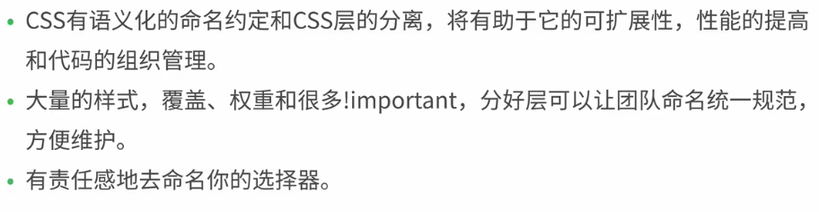<br/> 

### [SMACSS](http://smacss.com/)<br/>
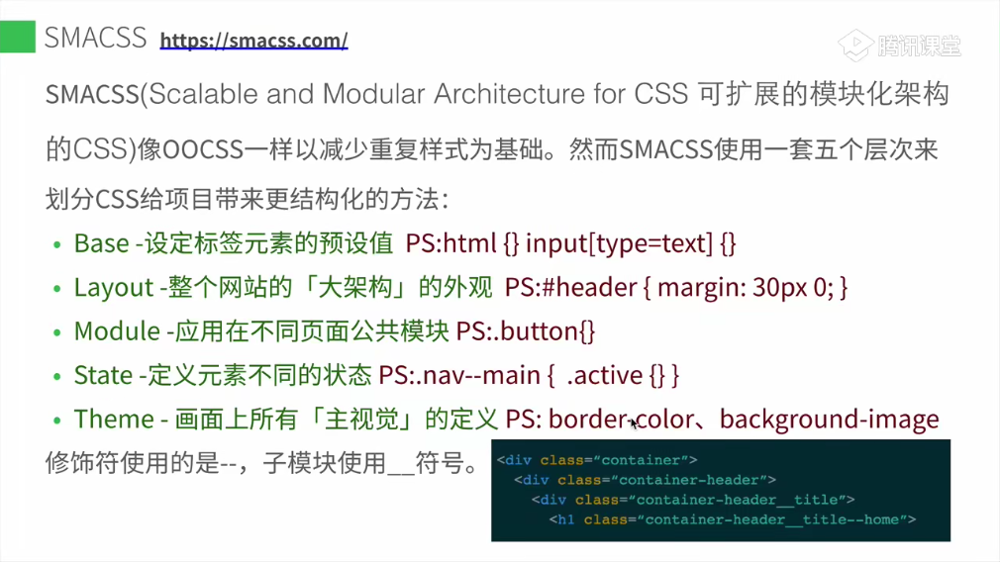<br/>
### BEM（业内常用）<br/>
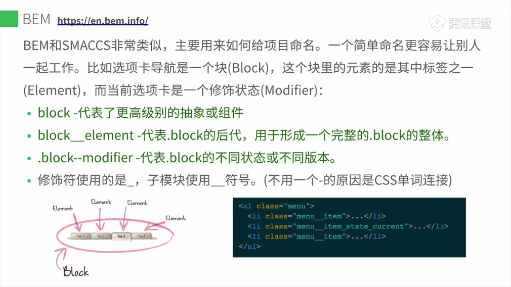<br/>
1. 实施原则：
* 抛开DOM模型，学习创建块。
* 不要使用ID选择器或标记选择器。
* 最小化嵌套选择器的数量。
* 使用CSS类命名约定以避免名称冲突，并尽可能使选择器名称见名之意。
* 使用块、元素和修饰符。
* 将块的CSS属性移动到修饰符（如果它们可能被更改）。
* 组合使用。
* 将代码划分为小的独立部分，以便于使用单独的块。
* 复用块
> [CSS命名规范——BEM思想（非常赞的规范）](https://www.cnblogs.com/dujishi/p/5862911.html)<br>
[BEM入门）](https://www.w3cplus.com/blog/tags/325.html)<br>
### SUIT<br/>
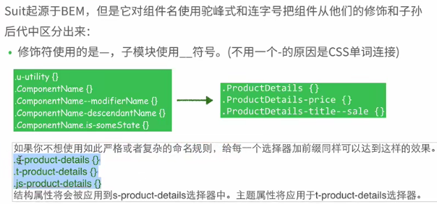<br/>
### ACSS（业内常用）<br/>
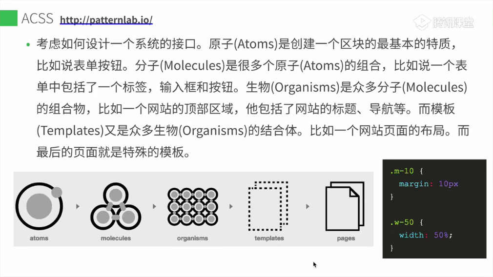<br/>
### ITCSS<br/>
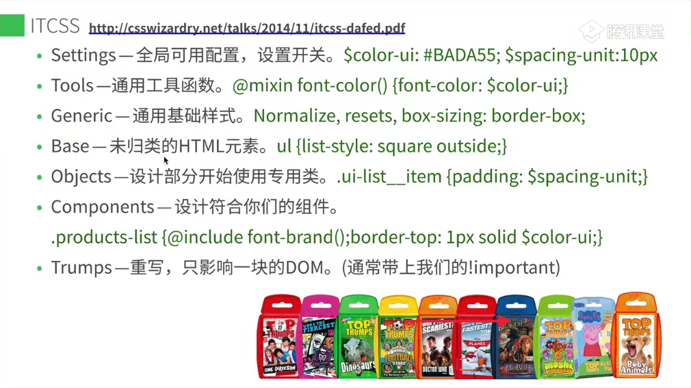<br/>
### OO CSS
1. OO CSS概念<br/>
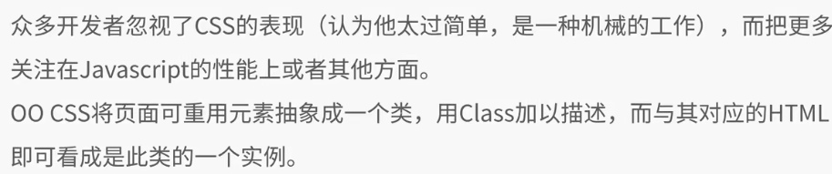<br/>
2. OO CSS的作用<br/>
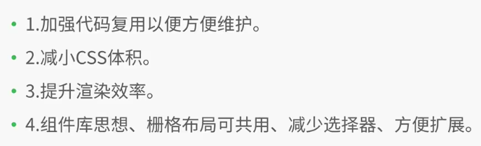<br/>
3. OO CSS的注意事项<br/>
* 不要直接定义子节点，应把共性申明放到父类；
* 结构和皮肤相分离
* 容器和内容相分离
* 抽象出可重用元素，建好组件库，在组件库内寻找可用的元素组装页面
* 给想要扩展的对象本身增加class而不是修改它的父节点
* 对象应保持独立性<br/>
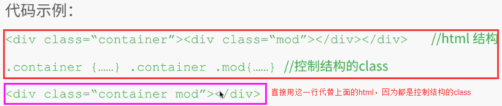<br/>
* 避免使用ID选择器
* 避免位置相关的样式-<br/>
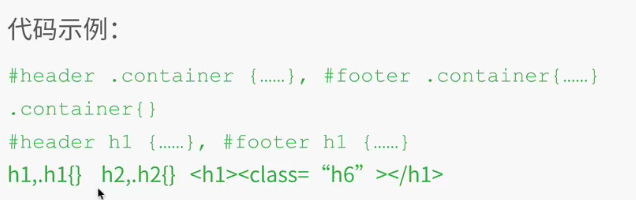<br/>
注：#footer h1与#header h1的样式有大部分是一样的，只有颜色可能不一样；但是我们不应该#footer h1与#header h1这两个选择器去实现不同的样式，而是应该给两个h1分别添加不同的class，在这个class里面书写他们的颜色
* 保证选择器相同的权重
* 类名 简短 清晰 语义化 OOCSS的名字并不影响HTML语义化
<br>
> 其他css分成理论博客：<br>
[css小书](https://www.kancloud.cn/cloud-dirge/css_book/1082706)<br>

## post-css
1. 理念 css in js
2. postcss值得收藏插件<br/>
<br/>
3. [css-doodle](https://css-doodle.com)是一个用来绘制CSS图案的WEB组件

## Houdini
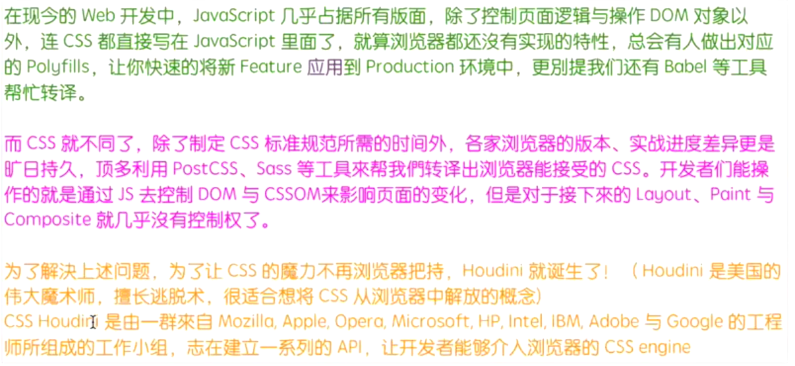<br/>
1. 理念 js in css

## 组件库色彩体系概念
1. 系统色板 - 基础色板 + 中性色板
2. 产品色板 - 品牌色[logo] + 功能色板[失败，成功、警告等]
2. 组件库样式变量分类
* 基础色彩系统
* 字体系统
* 表单
* 按钮
* 边框和阴影
* 可配置变量开关

## css选择器使用经验
1. last-child指的是当前元素的父元素下的最后一个子节点，在选择last-child之前添加类选择器无效。包括nth-last-child也一样


