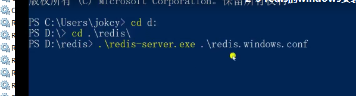
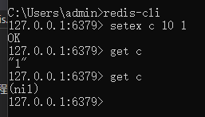
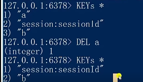

## windows下手动启动redis
```
.\redis-server.exe .\redis.windows.conf
```
<br/>

## windows下手动切换redis
```
redis-cli -p 6378
```

## redis命令
```
// setex: 用于设置一个指定的session
setex c 10 1
// 这里设置了一个session，key为c, value为1，过期时间为10s


// 查看redis中所有存储的key
KEYS *

// 删除某个key
DEL a
```
<br/>
<br/>
