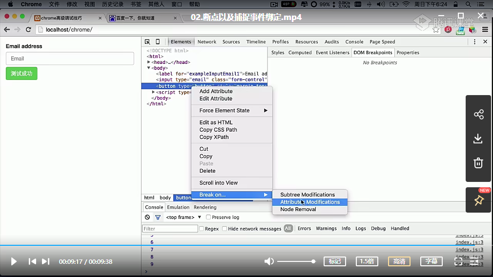
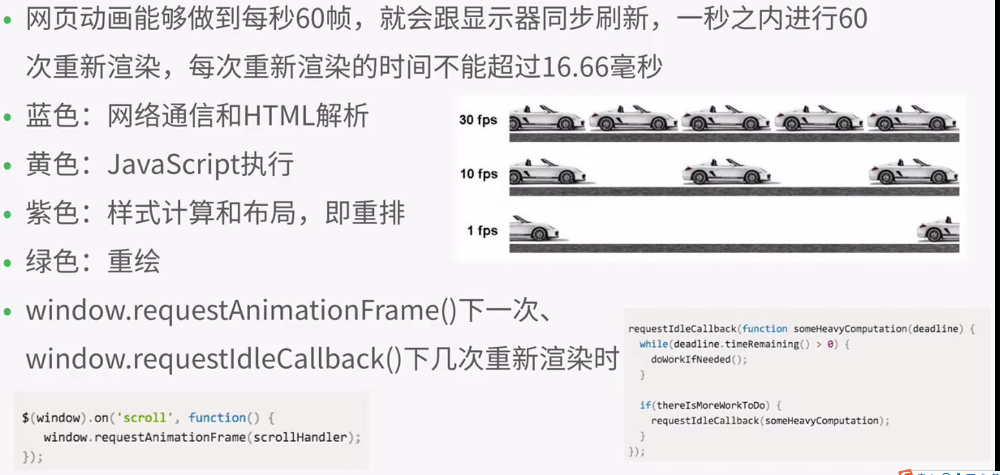
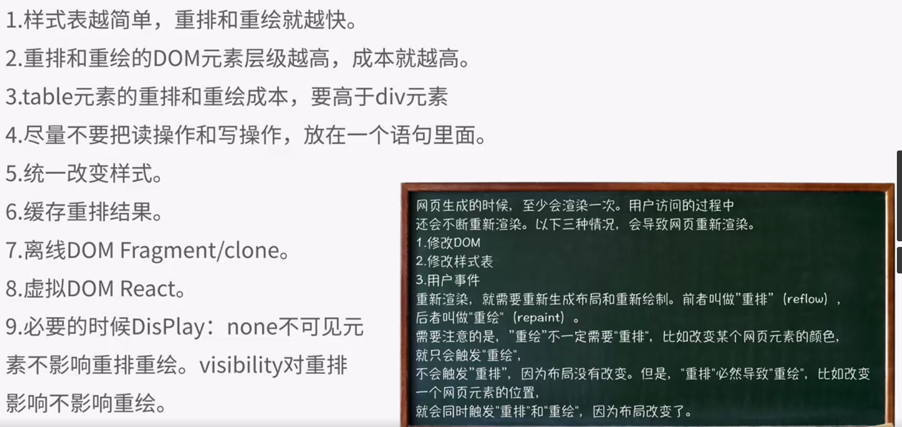
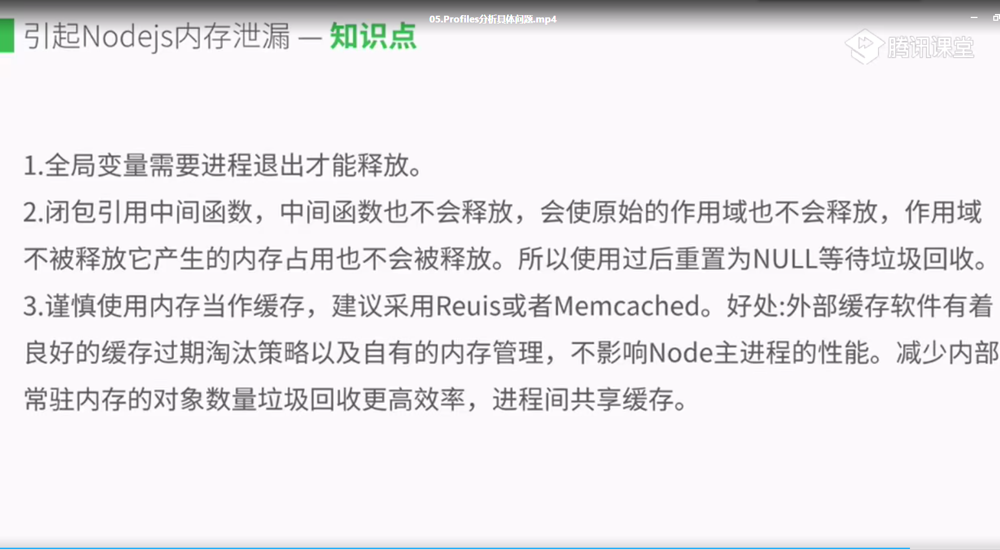

## 断点以及捕捉事件绑定
1. 断点 
 
2. 寻找事件监听
3. DOM元素断点
## Audits和Chrome性能插件
1. Audits
2. performanceTracer
3. page Speed
4. performace.timing
## Timeline掌控帧渲染模式
 
 
## Profiles分析具体问题
 

## 前端在线免费mock工具
1. [JSONPlaceholder](http://jsonplaceholder.typicode.com/);
2. [mocky.io](https://designer.mocky.io/)