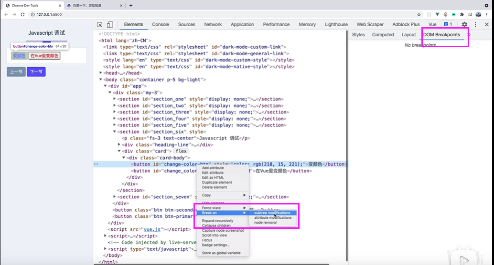
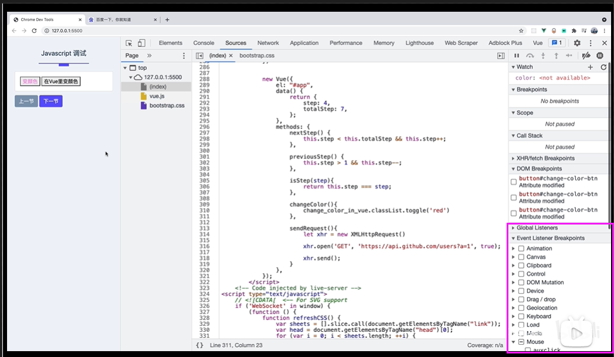
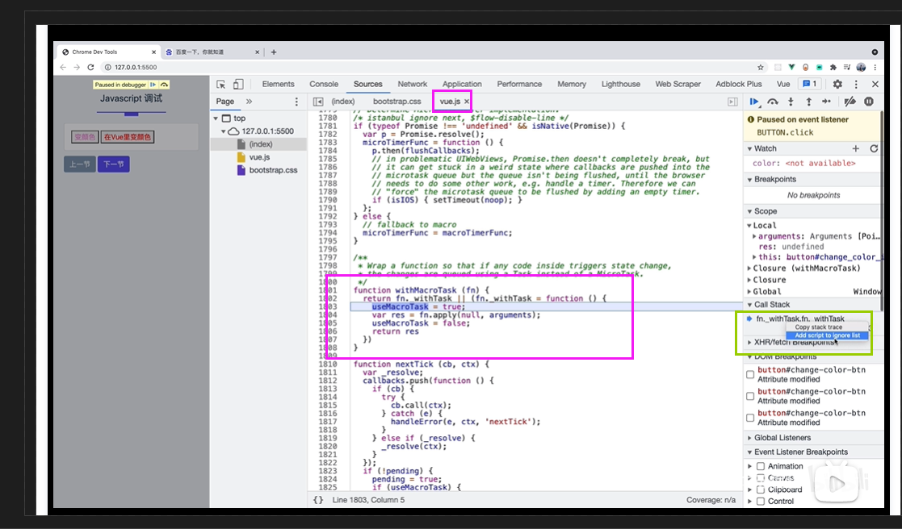
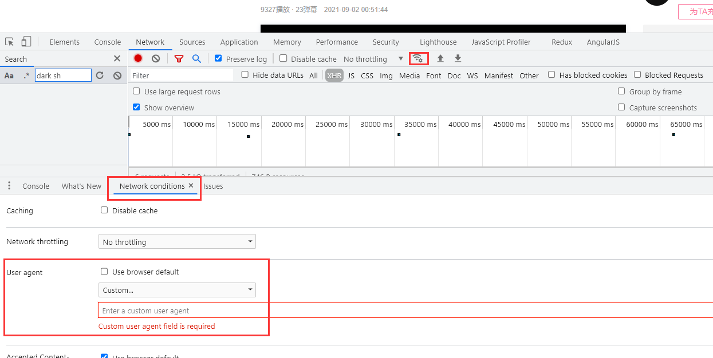
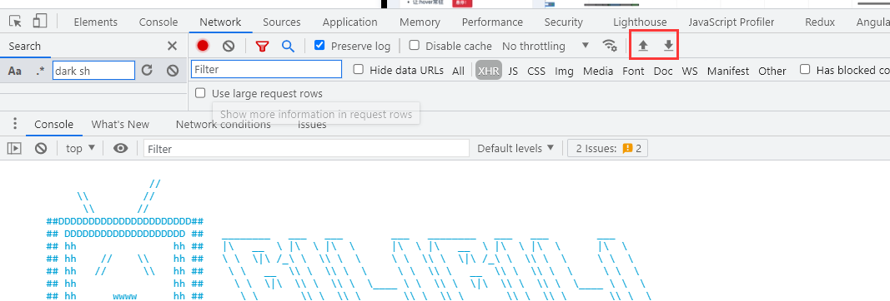

## console面板
1. `inspect(element)`  可以定位到相应节点；
2. $_ 返回上一条语句的执行结果；
3. $0 上一个选择的dom节点（$1, $2...）；
4. console中的方法：log, error, table, clear, group, time, assert, trace

## Elements面板
1. DOM Breakpoints-当我们在elements右键点击某个DOM节点时，选中如图所示的选项，会出现3个子选项 
  * subtree modifications : 当选中节点的子节点发生改变时，会触发断点 
  * attribute modifications : 当选中节点的属性发生改变时，会触发断点 
  * node removal : 当选中节点被移除时，会触发断点 
 

2. Event Listener Breakpoints-监听页面所有类型的事件
  * 在Vue中监听事件，代码如下图-点击文本“在Vue里变颜色”的按钮，按钮中的会切换颜色 
   
  第一步：我们在Event Listener Breakpoints勾选Mouse下面的click，页面上所有的点击事件都会被监听 
  第二步： 我们点击“在Vue里变颜色”按钮，这时会触发如下图中的断点，此时定位在vue.js文件中，因为我们事件是通过vue绑定和执行的，所以断点会在vue.js中触发；但是实际调试中我们并不期望断点出现在vue.js中，而是出现在我们自己写的代码中，那该怎么办呢？请看第三步 
   
  第三步：我们调试面板右侧找到如上图绿色的框的位置-call stack[调用栈]，我们选中call stack列表中的调用事件，右键选择“Add script to ignore list”.然后跳过本次断点，再次点击“在Vue里变颜色”按钮，断点会出现在我们自己写的代码当中，如下图。 
   

## Elements面板
1. 可以找到下图所在的位置，对浏览器的缓存，网速，userAgent信息，可接受的资源进行设置 
   
2. 可以找到下图所在的位置，对浏览器的请求信息导出，也可以导入第三方请求信息 
   

## Audits和Chrome性能插件
1. Audits
2. performanceTracer
3. page Speed
4. performace.timing

## Timeline掌控帧渲染模式
 
 
## Profiles分析具体问题
 

## 前端在线免费mock工具
1. [JSONPlaceholder](http://jsonplaceholder.typicode.com/);
2. [mocky.io](https://designer.mocky.io/)

## 其他
1. F12打开调试工具，再按`Ctrl+Shift+P`可以打开浏览器命令行