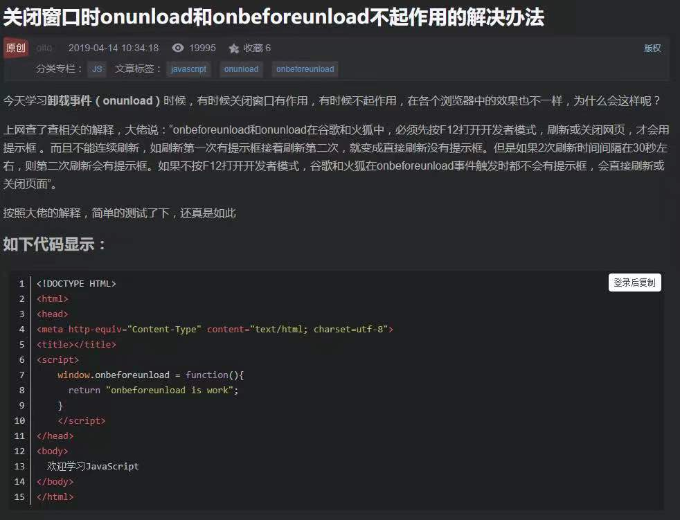
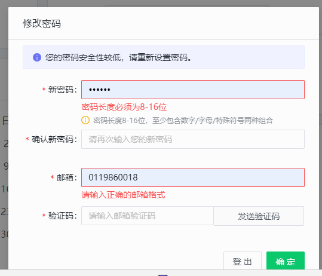
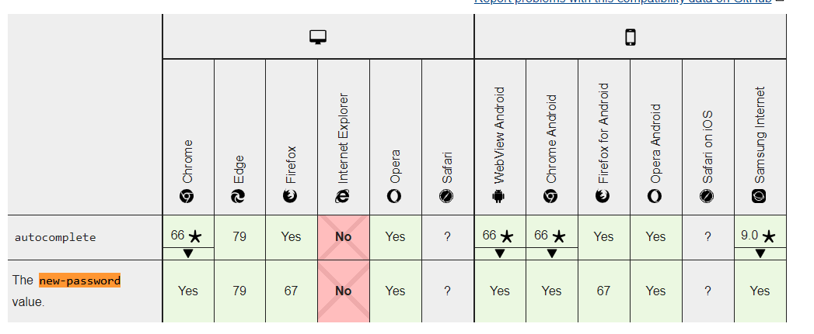

## 需求评估
1. 将功能点细分，并且要考虑需求实现以后，是否会影响到其他模块的数据查询、显示、统计等。
2. 是否需要多端实现
3. 产品需求逻辑不清楚，应将需求实现时间的冗余系数提升

## 兼容问题
1. iOS使用new Date()无法识别2019-08-15 15:10:40
```
// 在iOS中
const a = '2019-08-15 15:10:40';
console.log(new Date(a)); // 打印结果：invalid data；Android、PC会返回Date的实例对象
console.log(new Date(a.replace(/-/g, "/"))) // Android、PC、ios返回Date的实例对象

```

2. 自动切换360浏览器为极速模式,导致登陆失败。

原因：由于用户使用的是360浏览器兼容模式（IE模式）并通过第三方统一认证方式进入麦可思教学质量管理平台，麦可思教学质量管理平台会自动切换360浏览器为极速模式，麦可思教学质量管理在切换360浏览器倍和模式之前已经成功登录并将用户信息写入到兼容模式（IE模式）下的内核中，极速模式下无法抓取兼容模式内核中的用户信息，故会跳转到“麦可思教学质量管理平台登录页”
解决措施：前端添加第三方统一认证跳转登录逻辑
```
// 若页面需默认用极速模式，增加标签：
<meta name=”renderer”  content=”webkit”>
// 若页面需默认用IE兼容模式，增加标签：
<meta name=”renderer”  content=”ie-comp”>
// 若页面需默认用IE标准模式，增加标签：
<meta name=”renderer”  content=”ie-stand”>
```

3. 浏览器关闭事件监听<br/>
<br/>


4. Chrome浏览器保存密码功能会导致记录的密码带入了别的input<br/>
<br/>
解决措施：
* 现代浏览器都已停止在设置了 autocomplete="new-password" 的 `<input>` 元素上使用自动填充。例如，Firefox 67 版（见 bug 1119063）在这种情况下会停止自动填充；而 Firefox 70版（见 bug 1565407）则可以建议一个安全生成的密码，而不自动填充已保存的密码。autocomplete="new-password"兼容性如下：<br/>
<br/>
* 浏览器遇到type="text"与type="password"的`<input/>`标签紧邻时触发自动填充行为，则将两个`<input/>`隔开，使用隐藏的方式“欺骗”浏览器，将密码信息填写在隐藏区域。
```
.is-hidden {
    position: absolute;
    left: -10000px;
    top: -10000px;
}

/*让input看不见，而不是直接display: none，如果直接display: none，有些浏览器则不生效，比如谷歌*/
 
<input  type="text"  class="is-hidden" />
<input  type="password"  class="is-hidden" />
```
* 修改readonly属性
```
<input type="password" readonly onfocus="this.removeAttribute('readonly');"/>
```
5. `<col>`标签的min-width属性在Firfox与Chrome中表现不同-Firefox中有效，Chrome部分版本中无效.


## 微信公众号
1. 微信公众号推送问题 --- 微信公众开发过程修改前端页面路由，可能导致微信已经推送的带“链接”的消息失效（404）。


## 需求实现经验
1. 关于网页上echarts图片批量下载，遇到这个需求我们首先应该是先把功能进行拆解
* 第一步：先生成图片
* 第二步：再将所有图片打包
于是开始查找echrtsApi寻找图片导出方法，其次寻找前端打包文件的方法

2. 教评参照系需求缺陷：
* 问卷题目数据与参照系数据匹配状态的界定条件为考虑到题目和选项匹配的情况下，当前参照范围【高职，本科，双高】不存在此数据的问题；
* 关于参照范围【高职，本科，双高】变化导致匹配结果需要联动变化的问题。
> 如果要弥补以上两个缺陷前后端会增加很大工作量，如参照范围联动、开始配置和问卷题目参照系修改都需要添加大量逻辑处理；
最终我们还是本着产品必须满足必须以客户为导向的理念完成了上面两个缺陷。

## 前端接口请求，每次返回响应结果时间过长，即一直处于pending状态，要考虑到time out超时报错。


