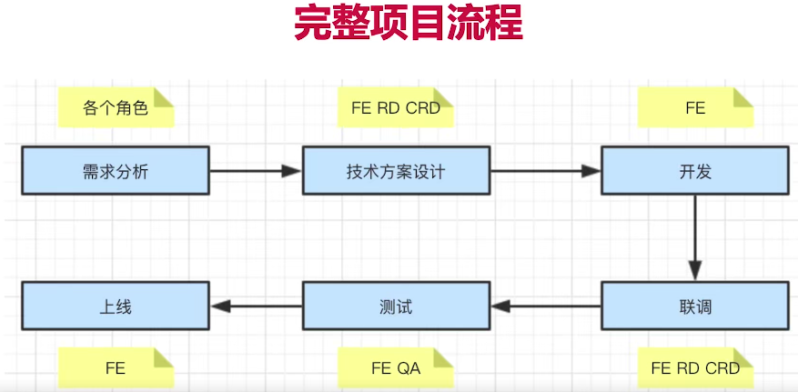

## 项目角色
* PM 产品经理
* UE 视觉设计师
* FE 前端开发
* RD 后端开发
* CRD 移动端开发(ios/android)
* PM 产品经理
* PM 产品经理

## 完整的项目流程
 

## stage 1-需求分析
1. 需求背景
2. 质疑需求合理性
3. 需求是否闭环
4. 开发难度如何（动画等）
5. 是否需要其他支持（后端等）
6. 评审结束不要急于排期

## stage 2-技术方案设计
1. 求简，不要过渡设计
2. 讨论结果必须要有文档
3. 找准设计重点
4. 项目组内评审
5. 和RD，CRD沟通【文字沟通方便保存记录】
6. 发出会议结论

## stage 3-开发
1. 排期安排
2. 符合开发规范
3. 写出开发文档
4. 单元测试
5. mock api
6. code review

## stage 4-联调
1. 和RD(后端)，CRD联调
2. 让UE确定视觉效果（在开发过程中，必要时也需要UE介入）
3. 让PM确定产品功能（在开发过程中，必要时也需要PM介入）

## stage 5-测试
1. 提测发邮件，抄送项目组
2. bug管理工具-记录测试问题
3. 有问题及时沟通

## stage 5-上线
1. 回归测试
2. 如有问题，及时回滚。
3. 同步给PM和项目组

## 其他
1. 项目沟通
* 多人协作，沟通时最重要的事情
* 每日一沟通（站会），有事说事，无事报平安
* 及时汇报风险

2. PM及需求怎么办？
* 不能拒绝，走需求变更流程即可；
* 如果公司有规定，则按规定走；
* 发起项目组和leader的评审，重新评估排期

1.熟练使用HTML5、CSS3、ES6、TypeScript、Sass、Less、Echarts等进行PC端和移动端的webApp开发，数据可视化大屏，以及微信小程序开发；基于open layer的二维地图web应用开发，高德地图、百度地图、天地图瓦片对接等。
2.熟练使用React + Redux/Dva + React-Router+Antd/Antd-Mobile；熟练使用Vue + Vuex + Vue-Router+Vant/ElementUI等；可从0到1搭建新项目；基于HybridAPP的内嵌H5应用开发与JSBridge的原生能力调用调试等；
3.熟练使用jest搭建前端自动化测试，TDD测试，BDD测试，测试覆盖率检查；
4.熟练使用自动构建工具Webpack并了解其原理，loader和plugin编写，以及常见的打包优化配置；了解nodejs、koa、express。
5.实现过类似antd简单版UI库案例，具有类库封装经验，例如：storybook的使用，组件库的测试； 
6.代码管理平台和mock平台搭建，熟练使用Git命令、常见的Linux命令；
在实际项目中使用过一段时间的PHP，对后端业务的实现有一定的了解。